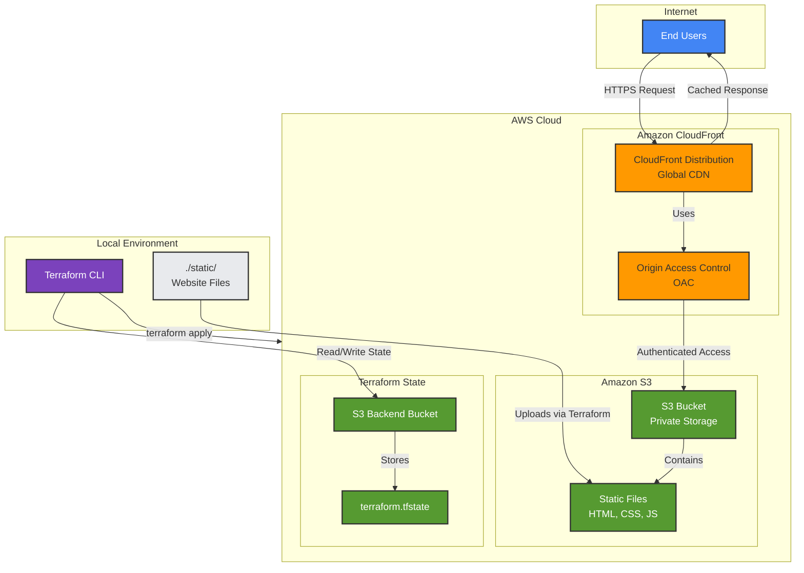

# Architecture Diagram

## Static Website Hosting on AWS

## Component Description

### User Layer
- **End Users**: Website visitors accessing content via HTTPS

### AWS CloudFront Layer
- **CloudFront Distribution**: Global CDN with edge locations for low-latency delivery
- **Origin Access Control (OAC)**: Secure authentication mechanism for S3 access
- **HTTPS Enforcement**: Automatic HTTP to HTTPS redirection
- **Caching**: Content cached at edge locations (TTL: 1 hour default)

### AWS S3 Layer
- **S3 Bucket**: Private object storage for static website files
- **Public Access Blocked**: All public access disabled for security
- **Static Files**: HTML, CSS, JavaScript, and media files
- **Content-Type Headers**: Proper MIME types for browser rendering

### Terraform State Management
- **S3 Backend Bucket**: Remote state storage for team collaboration
- **terraform.tfstate**: Current infrastructure state tracking
- **State Locking**: Prevents concurrent modifications (optional DynamoDB)

### Local Development
- **Terraform CLI**: Infrastructure provisioning and management
- **Static Files Directory**: Source files for website content
- **IaC Configuration**: Terraform .tf files defining infrastructure

## Request Flow

1. User requests website content via CloudFront URL (HTTPS)
2. CloudFront checks edge location cache
3. If cached, content served immediately (cache hit)
4. If not cached, CloudFront uses OAC to authenticate with S3
5. S3 verifies request originates from authorized CloudFront distribution
6. S3 returns requested object to CloudFront
7. CloudFront caches object and serves to user
8. Subsequent requests served from cache until TTL expires

## Security Model

- **Network Security**: No direct public access to S3 bucket
- **Identity & Access**: OAC provides service-to-service authentication
- **Encryption**: HTTPS in transit, optional encryption at rest
- **Authorization**: S3 bucket policy restricts access to specific CloudFront distribution

## Deployment Flow

1. Developer updates files in `./static/` directory
2. Execute `terraform apply` command
3. Terraform reads current state from S3 backend
4. Terraform creates/updates AWS resources:
   - Creates/updates S3 bucket
   - Uploads static files with correct MIME types
   - Configures CloudFront distribution
   - Sets up OAC and bucket policies
5. Terraform writes new state to S3 backend
6. CloudFront distribution propagates globally (5-15 minutes)
7. Website accessible via CloudFront URL

## Cost Considerations

- **S3 Storage**: Pay for GB stored per month
- **S3 Requests**: Charged per PUT/GET request
- **CloudFront Data Transfer**: Charged per GB transferred to users
- **CloudFront Requests**: Charged per 10,000 HTTPS requests
- **Free Tier Eligible**: AWS Free Tier includes S3 and CloudFront allowances

## Scalability

- **Auto-Scaling**: CloudFront and S3 automatically scale with traffic
- **No Capacity Planning**: Fully managed services handle load
- **Global Distribution**: Content served from nearest edge location
- **High Availability**: AWS manages redundancy and failover
